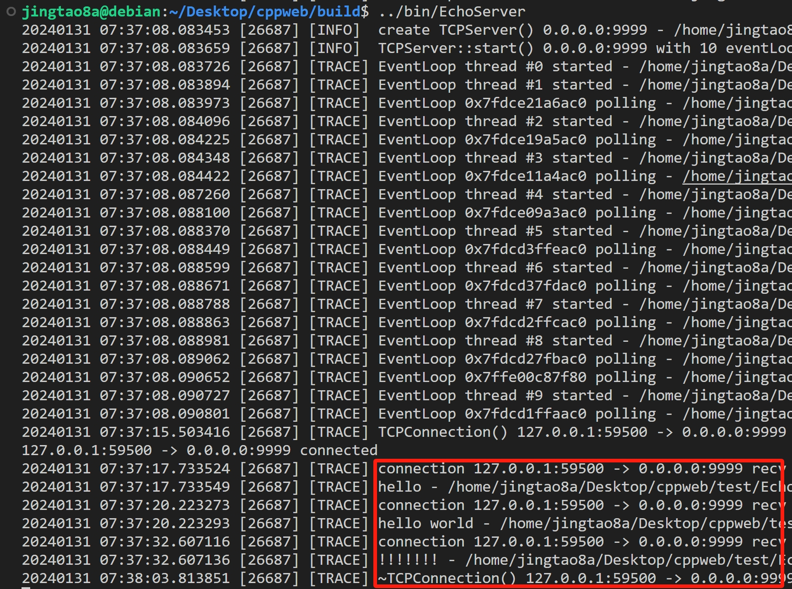
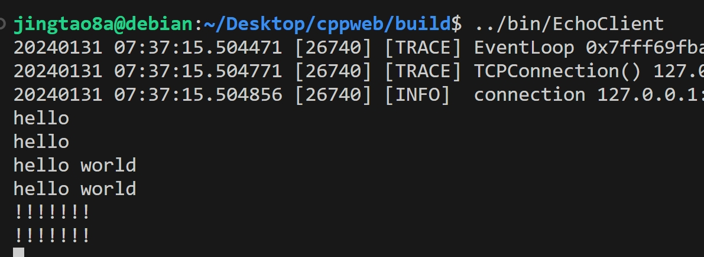

## A simple cpp web库

#### 定时器模块:
[TimeStamp](./docs/TimeStamp.md)
[Timer](./docs/Timer.md)
[TimerQueue](./docs/TimerQueue.md)

#### 日志器模块:
[Logger](./docs/Logger.md)

#### 缓冲区模块:
[Buffer](./docs/Buffer.md)

#### 线程池模块:
[ThreadPool](./docs/ThreadPool.md)

#### EventLoop模块
[Channel](./docs/Channel.md)
[EventLoop](./docs/EventLoop.md)

### TCP client 和 server模块
[TCP client and server](./docs/TCPClientAndServerSingle.md)

### usage
```shell
git clone 
```

### example
EchoServer
```cpp
#include "cppweb/Singleton.hpp"
#include "cppweb/Logger.hpp"
#include "cppweb/EventLoop.hpp"
#include "cppweb/TCPServer.hpp"
#include "cppweb/Buffer.hpp"
#include "cppweb/TCPConnection.hpp"
#include <iostream>

static auto& logger = CPPWEB::Singleton<CPPWEB::Logger>::GetInstance();

class DiscardServer {
public:
    DiscardServer(CPPWEB::EventLoop* loop, const CPPWEB::InetAddress& addr):
        m_loop(loop),
        m_server(loop, addr) {
        m_server.setThreadNum(10);
        m_server.setMessageCallback(std::bind(&DiscardServer::onMessage, this, std::placeholders::_1, std::placeholders::_2));
        m_server.setConnectionCallback(std::bind(&DiscardServer::Connection, this, CPPWEB::_1));
    }

    void start() {
        m_server.start();
    }

    void onMessage(const CPPWEB::TCPConnectionPtr& conn, CPPWEB::Buffer& buffer) {
        TRACE(logger, "connection %s recv %lu bytes", conn->name().c_str(), buffer.readableBytes());
        std::string str = buffer.retrieveAllAsString();
        TRACE(logger, "%s", str.c_str());
        conn->send(str);
    }
    void Connection(const CPPWEB::TCPConnectionPtr& conn) {
        if (conn->isConnected()) {
            std::cout << conn->name() << " connected" << std::endl;
        }
    }
private:
    CPPWEB::EventLoop* m_loop;
    CPPWEB::TCPServer m_server;
};


int main() {
    CPPWEB::EventLoop loop;
    CPPWEB::InetAddress addr(9999);
    DiscardServer server(&loop, addr);
    server.start();
    loop.loop();
    return 0;
}
```

EchoClient
```cpp
#include "cppweb/Logger.hpp"
#include "cppweb/Singleton.hpp"
#include "cppweb/EventLoop.hpp"
#include "cppweb/TCPClient.hpp"
#include "cppweb/nocopyable.hpp"
#include <iostream>
#include <thread>

static auto& logger = CPPWEB::Singleton<CPPWEB::Logger>::GetInstance();

class UserInput: public CPPWEB::nocopyable {
public:
    UserInput(const CPPWEB::TCPConnectionPtr& conn):
        m_conn(conn) {
        m_conn->setMessageCallback(std::bind(&UserInput::onMessage, this, CPPWEB::_1, CPPWEB::_2));
    }

    void onMessage(const CPPWEB::TCPConnectionPtr& conn, CPPWEB::Buffer& buffer) {
        std::cout << buffer.retrieveAllAsString() << std::endl;
    }

    void run() {
        std::string line;
        while(std::getline(std::cin, line)) {
            m_conn->send(line);
        }
        m_conn->shutdown();
    }
private:
    CPPWEB::TCPConnectionPtr m_conn;
};

class EchoBench: public CPPWEB::nocopyable {
public:
    EchoBench(CPPWEB::EventLoop* loop, const CPPWEB::InetAddress& addr) :
        m_loop(loop),
        m_client(loop, addr) {
        
        m_client.setConnectionCallback(std::bind(&EchoBench::onConnection, this, CPPWEB::_1));
    }

    void start() {
        m_client.start();
    }
    void onConnection(const CPPWEB::TCPConnectionPtr& conn) {
        INFO(logger, "connection %s is [%s]", conn->name().c_str(), conn->isConnected() ? "up" : "down");
        if (!conn->isDisconnected()) {
            auto th = std::thread([conn]() {
                UserInput user(conn);
                user.run();
            });
            th.detach();
        } else {
            m_loop->quit();
        }
    }

private:
    CPPWEB::EventLoop *m_loop;
    CPPWEB::TCPClient m_client;
};

int main() {
    CPPWEB::EventLoop loop;
    CPPWEB::InetAddress addr("127.0.0.1", 9999);
    EchoBench client(&loop, addr);
    client.start();
    loop.loop();
    return 0;
}

```

结果：




***
## others:
[TCP连接异常断开情况](./docs/TCP连接异常断开.md)
