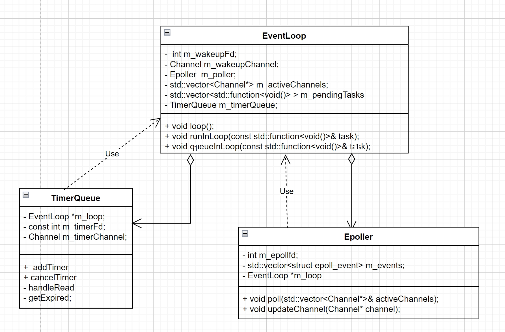

EventLoop、TimerQueue、Epoller的关系



- EventLoop持有一个Epoller和一个TimerQueue<br>
- Epoller和TimerQueue对EventLoop为关联关系<br>

EventLoop
```cpp
void EventLoop::loop() {
    while (true) {
        // Epoller执行poll将唤醒的Channel放入m_activeChannels中
        Epoller.poll(m_activeChannels);
        //遍历m_activeChannels
        for (channel : m_activeChannels) {
            channel->handleEvents();//执行channel中的回调函数
        }

        //执行m_pendingTasks中的任务
        doPendingTask();
    }
}

//加入pendingTask
void EventLoop::runInLoop(const std::function<void()>& task) {
    if (isInLoopThread()) {
        task();
    } else {
        queueInLoop(task);
    }
}

void EventLoop::queueInLoop(const std::function<void()>& task) {
    {
        std::lock_guard<std::mutex> guard(m_mutex);
        m_pendingTasks.push_back(task);
    }
    wakeup();//往EventLoop的m_wakeupFd发送数据，唤醒m_wakeupFdChannel
}
```