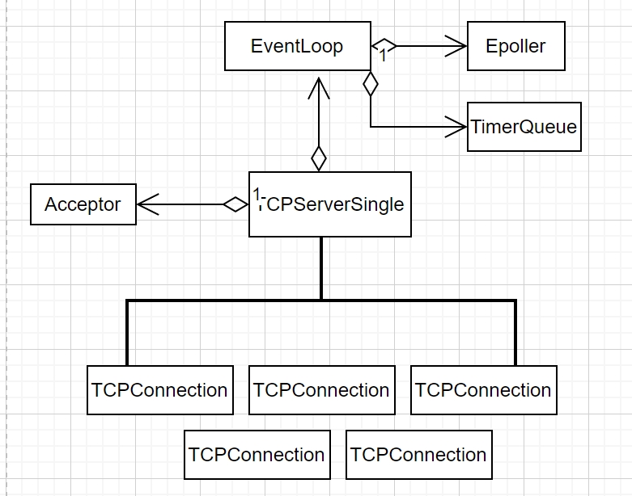
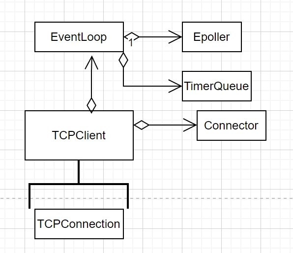
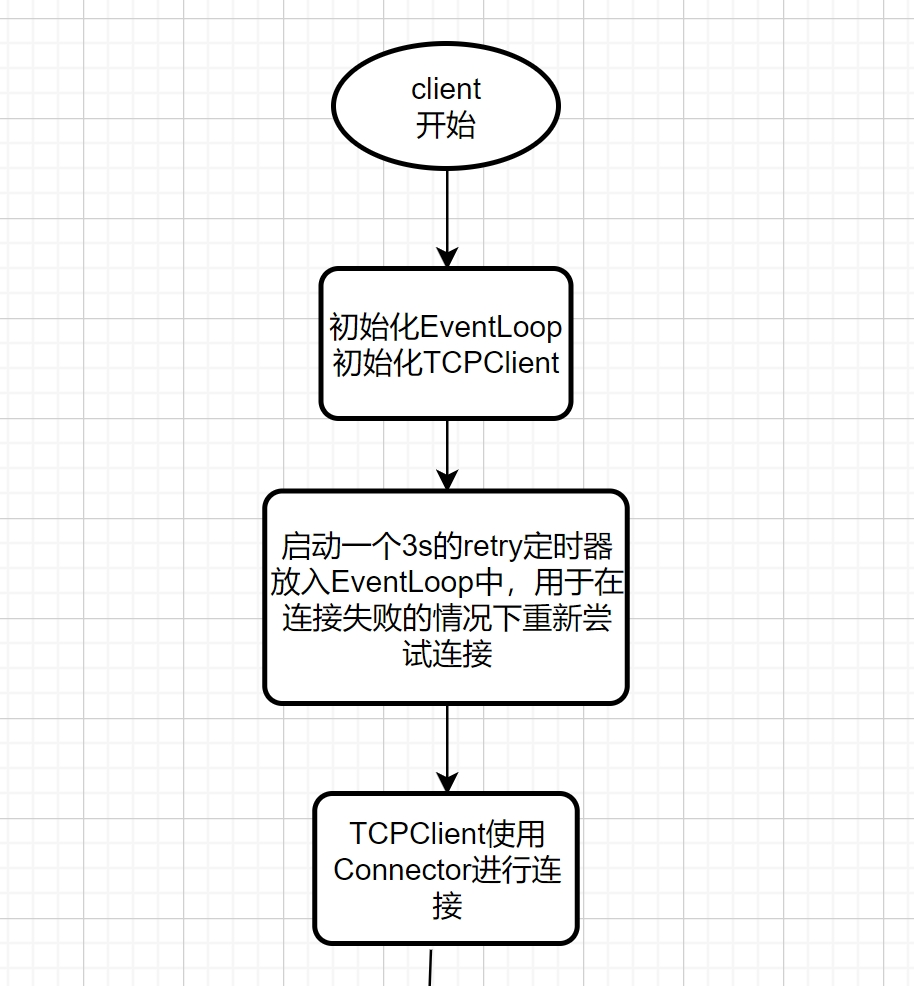
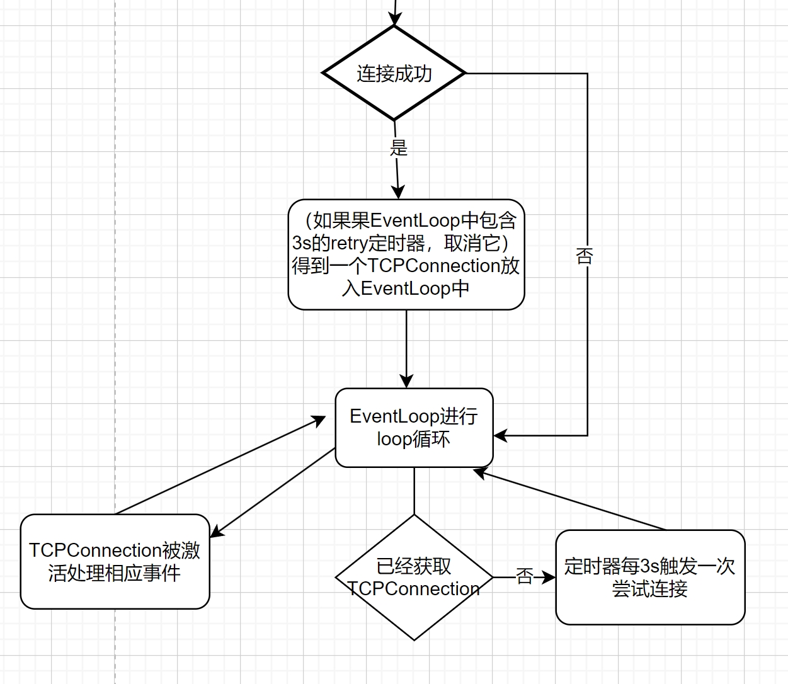
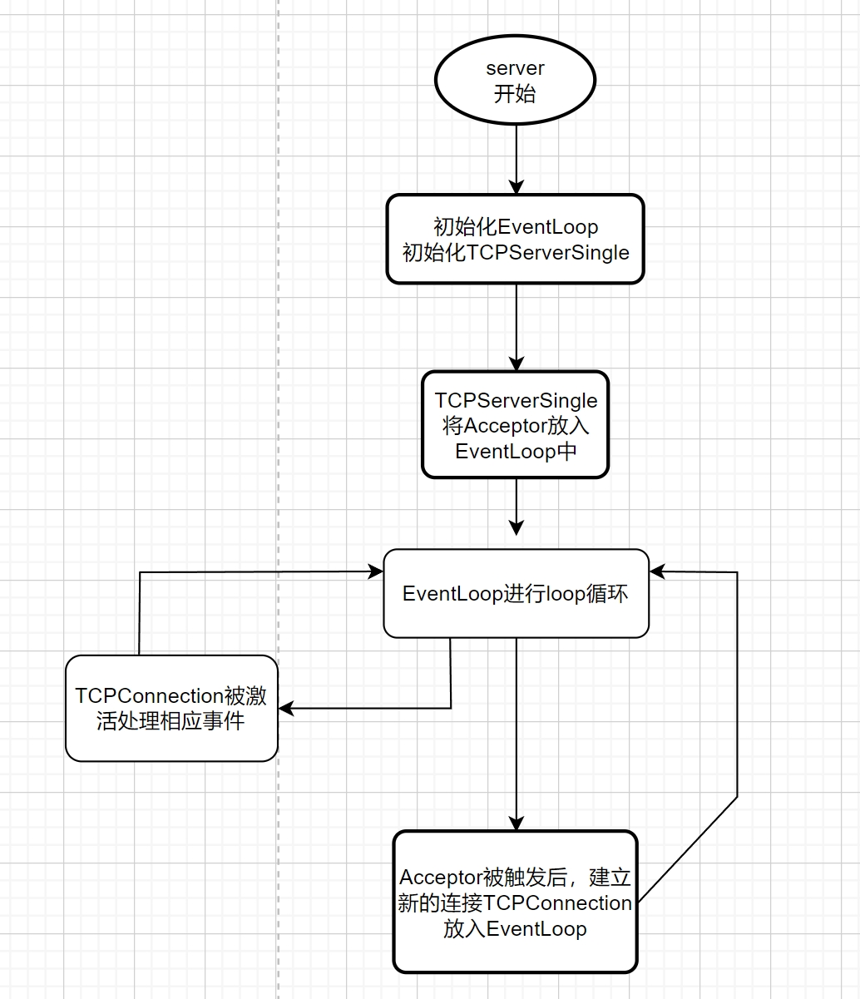

```cpp
enum ConnectionState {
    kConnecting,//等待连接
    kConnected,//连接建立
    kDisconnecting,//半连接状态
    kDisconnected,//连接关闭
};

class TCPConnection {
    EventLoop* m_loop;
    const int m_sockfd;//建立好连接的socket套接字
    Channel m_channel;//封装m_sockfd的Channel
    int m_state;//该连接的状态
    InetAddress m_local;//源地址
    InetAddress m_peer;//目的地址
    Buffer m_inputBuffer;//输入缓冲区
    Buffer m_outputBuffer;//输出缓冲区
};
```

服务端：
```cpp
class TCPServerSingle {
    MessageCallback m_messageCallback;
    WriteCompleteCallback m_writeCompleteCallback;
    ConnectionCallback m_connectionCallback;

    std::unordered_set<TCPConnectionPtr> m_connectionSet;//维护一定数量的TCPConnection
    EventLoop* m_loop;
    Acceptor m_acceptor;
};

class Acceptor {
    EventLoop *m_loop;
    const InetAddress m_localAddress;//绑定的ip+port地址
    const int m_acceptFd;//绑定ip+port的socket
    Channel m_acceptChannel;//封装m_acceptFd的Channel
    NewConnectioCallback m_newConnectionCallback;
};
```


客户端
```cpp
class TCPClient {
    bool m_connected;
    const InetAddress m_peer;
    Timer* m_retryTimer;

    MessageCallback m_messageCallback;
    WriteCompleteCallback m_writeCompleteCallback;
    ConnectionCallback m_connectionCallback;
    
    TCPConnectionPtr m_connection;//维护一个TCPConnection
    EventLoop* m_loop;
    Connector m_connector;
};

class Connector {
    EventLoop* m_loop;
    const InetAddress m_peer;//对端地址
    const int m_sockfd;//用于连接服务端的m_sockfd
    Channel m_channel;//包装m_sockfd的Channel

    NewConnectioCallback m_newConnectionCallback;
};
```



上图中的TCPConnection、Connector和TimerQueue都可以看做是Channel<br>
EventLoop使用Epoller进行轮询处理激活的Channel，和处理pendingTask

TCPClient和TCPServerSingle建立连接的过程

### TCPClient工作流程图



### TCPServerSingle工作流程图


### TCPServer
启动包含多个TCPServerSingle，每个TCPServerSingle绑定相同的ip和port,并且每个TCPServerSingle单独使用一个EventLoop
